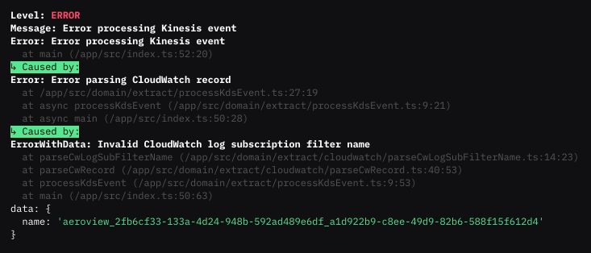

<picture>
    <source srcset="docs/jsout.svg" media="(prefers-color-scheme: dark)">
    <source srcset="docs/jsout-dark.svg" media="(prefers-color-scheme: light)">
    
</picture>

[](https://github.com/mhweiner/jsout/actions)
[]()
[](https://conventionalcommits.org)
[](https://github.com/mhweiner/autorel)


A Syslog-compatible, simple, structured logging tool for **Node.js, Bun, Deno, and browser environments**. Sponsored by [Aeroview](https://aeroview.io).

<picture>
    <source srcset="docs/error-screenshot.svg">
    
</picture>

## Features

**😃 Built for developer happiness & productivity**
- Automatic Error serialization
- Automatically removes noisy internal stack traces such as `node:internal/...`
- Colorized, formatted human-readable output for local development
- Supports [`Error.cause`](https://medium.com/ovrsea/power-up-your-node-js-debugging-and-error-handling-with-the-new-error-cause-feature-4136c563126a) for error chaining/traces across layers of your application

**🌐 Universal JavaScript Support**
- **Node.js**: Full feature support with colors and formatting
- **Bun**: Full feature support with colors and formatting  
- **Deno**: Full feature support with colors and formatting
- **Browser**: JSON logging with graceful color degradation
- **Zero runtime dependencies** - completely self-contained

**🔒 Syslog Compatible Structured Logs**
- JSON output for log aggregation into services like [Aeroview](https://aeroview.io) and [CloudWatch](https://aws.amazon.com/cloudwatch/)
- Standardized [Syslog](https://datatracker.ietf.org/doc/html/rfc5424) log levels and output

**🛡 Defensive & DevOps Friendly**
- Production settings by default for safety
- Transport handled [outside of the process via `stdout` and `stderr`](#why-should-logs-use-stdout-and-stderr)
- Easy to use and simple configuration
- **Zero dependencies**. Fast & reliable TypeScript codebase
- Excellent test coverage (>90%)

## Installation

### Node.js / npm
```bash
npm i jsout
```

### Bun
```bash
bun add jsout
```

### Deno
```typescript
import {logger} from 'npm:jsout';
```

## Cross-Platform Support

jsout works seamlessly across all JavaScript environments:

| Environment | Colors | CLI Format | JSON Format | Dependencies |
|-------------|--------|------------|-------------|--------------|
| **Node.js** | ✅ Full | ✅ Full | ✅ Full | Zero |
| **Bun** | ✅ Full | ✅ Full | ✅ Full | Zero |
| **Deno** | ✅ Full | ✅ Full | ✅ Full | Zero |
| **Browser** | ❌ No-op | ✅ Plain text | ✅ Full | Zero |

### Environment-Specific Behavior

**Terminal Environments (Node.js, Bun, Deno):**
- Full ANSI color support
- CLI/human-readable formatting with colors
- JSON output with proper formatting

**Browser Environment:**
- Colors gracefully degrade to plain text
- JSON or human-readable output

## Zero Dependencies

jsout is completely self-contained with **zero runtime dependencies**. This provides several benefits:

- **🚀 Faster installation** - No dependency resolution or downloads
- **📦 Smaller bundle size** - Perfect for browser and edge environments
- **🔒 Better security** - No external dependencies to audit
- **🌐 Universal compatibility** - Works everywhere JavaScript runs
- **⚡ Faster startup** - No module resolution overhead

The library includes its own lightweight implementations of:
- ANSI color codes for terminal environments
- Portable object inspection (mimics `util.inspect`)
- Graceful fallbacks for non-terminal environments

## Example Usage

```typescript
import {logger} from 'jsout';

logger.info('test message');
logger.fatal('oops!', new Error(), {foo: 'bar'})
logger.error('', new Error('test')); //infers "test" as message

// Output: {"level":6,"message":"test message","data":{}}
// Output: {"level":0,"message":"oops!","data":{"foo":"bar"},"error":{"message":"Error","stack":"Error: Error\n    at Object.<anonymous> (/path/to/app.js:1:1)\n"}}
// Output: {"level":3,"message":"test","data":{},"error":{"message":"test","stack":"Error: test\n    at Object.<anonymous> (/path/to/app.js:1:1)\n"}}
```

## Plugins

- [Express Request Logger](https://github.com/mhweiner/jsout-express)

## Configuration

Configuration is set through environment variables. 

By default, the logger is set to `info` level and `json` format, which is recommended for production.

We recommend using the following settings for local development:

```bash
LOG=debug LOG_FORMAT=cli node /path/to/app.js
```

### `LOG`

Sets the log level. Log levels are based on the [syslog](#api) levels. Values can be either the number or the string representation of the log level. Logs with a level less than the specified level will not be emitted.

For example, if the log level is set to `info`, logs with a level of `debug` will not be emitted.

**Possible values**:

| Number | String |
|-------|--------|
| `2`     | `critical` |
| `3`     | `error`    |
| `4`     | `warn`     |
| `5`     | `notice`   |
| `6`     | `info`     |
| `7`     | `debug`    |

**Default**: `info` (recommended for production)

### `LOG_FORMAT`

Set the format for the output to either be human-readable (great for local development in the console), or JSON formatted (great for data aggregation on a server).

**Possible values**: `cli`, `json`

**Default**: `json` (recommended for production)

## Logger API 

Log levels are based on the [syslog](https://datatracker.ietf.org/doc/html/rfc5424) levels:

| Level | Severity | Example |
|-------|------------|---------|
| 0     | Emergency      | <sup>System is unusable. Should not be used by typical applications.</sup> |
| 1     | Alert      | <sup>Action must be taken immediately to prevent system failure. For example, a process is down. Should not be used by typical applications.</sup> |
| 2     | Critical/Fatal       | <sup>Critical conditions. For example, a hard disk is full, or process is crashing. Unrecoverable errors.</sup> |
| 3     | Error        | <sup>Error conditions. For example, a failed request resulting in a 500 HTTP response.</sup> |
| 4     | Warning    | <sup>Warning conditions. For example, a process is using too much memory. Fully recoverable, not immediate issue.</sup> |
| 5     | Notice     | <sup>Normal but significant events that do not indicate a problem. Ie, a process is starting.</sup> |
| 6     | Informational       | <sup>General informational messages about normal operations.</sup> |
| 7     | Debug      | <sup>Debugging messages.</sup> |

These might be too granular for most applications, so here's what we recommend:

- **Emergency & Alert**: Reserved for infra-level logs. Should not be used by typical user applications.
- **Fatal**: Unrecoverable errors, such as a process crashing.
- **Error**: Recoverable errors, such as a failed request.
- **Warning**: 4xx HTTP responses, unexpected behavior, or potential issues.
- **Info**: Anything else that might be useful to debug the application. However, beware of logging sensitive information and overloading logs with too much information. This can get expensive and slow down your application.

For those functions that accept error objects, the `error` object is automatically serialized into a JSON object. `error` should be an instance of `Error` with a stack trace, but this is not enforced.

`data` is an object, containing any contextual information that might be useful to debug the error, or any pertinant information relating to the log message.

### Emergency (0)

- `logger.emerg(message?: string, error?: any, data?: any)`

### Alert (1)

- `